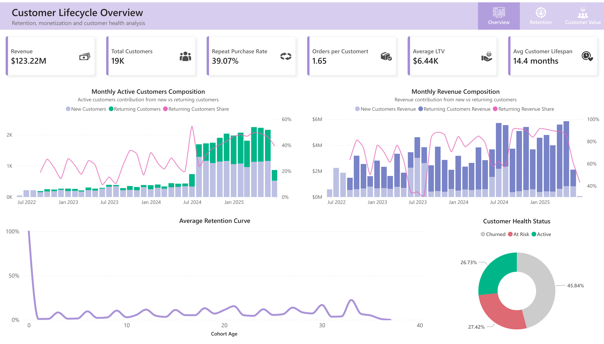
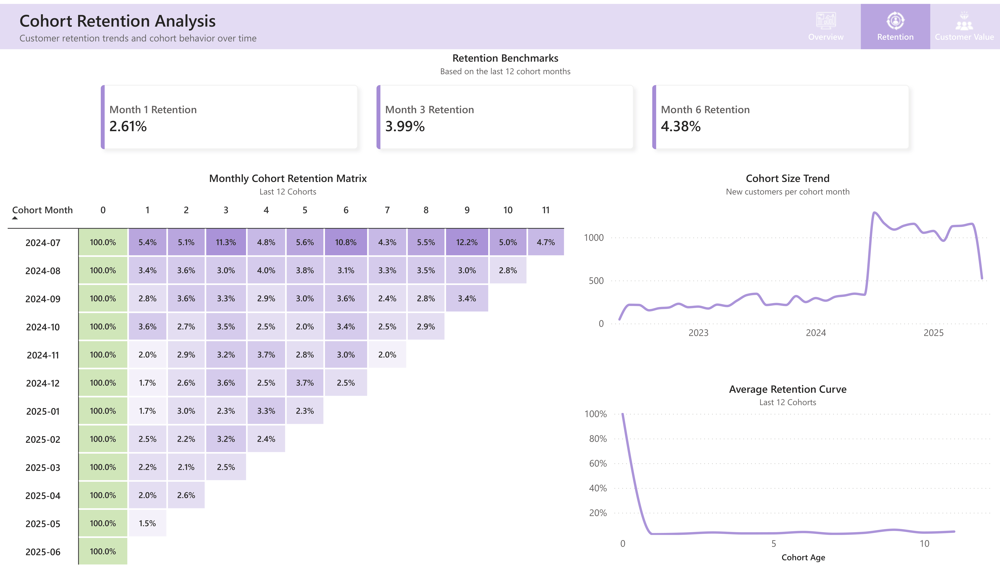
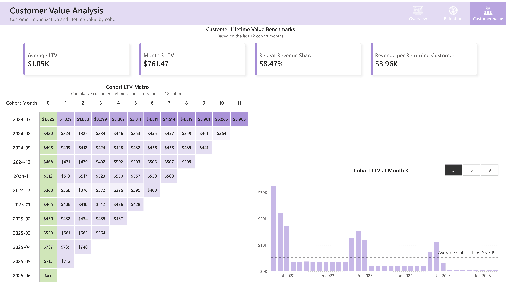

# 📊 Customer Lifecycle & Cohort Analytics

Interactive customer lifecycle analytics dashboard focused on cohort retention, customer value, and monetization trends using SQL Server and Power BI.

🔗 **Live Dashboard:** 
[View Power BI Report](https://app.powerbi.com/view?r=eyJrIjoiMzQ2NzRkMzItYTYxZS00OTM0LWI1M2ItYzhlNzc0YmNkNDI2IiwidCI6IjY2ZmViZjA0LTBjNWMtNGYwMi1hMzA2LTM3OTFlYjIyNWNhNSJ9)

<br>

## 📌 Project Overview

This project explores customer behavior and long-term business performance for an e-commerce marketplace using cohort analysis techniques.  
The dashboard was designed to analyze:

- customer retention dynamics
- cohort monetization trends
- customer lifetime value (LTV)
- repeat customer contribution to revenue
- overall customer health and lifecycle patterns

The project combines SQL-based data modeling with interactive Power BI visualizations to simulate a real-world customer analytics workflow.

<br>

## 🎯 Business Goal

The main objective of this project was to understand:

- how well customers are retained over time
- how customer value evolves after acquisition
- whether revenue growth is driven by new or returning customers
- which customer cohorts generate the highest long-term value
- how monetization quality changes across acquisition periods

This type of analysis helps e-commerce businesses evaluate:
- customer acquisition quality
- retention effectiveness
- long-term revenue sustainability
- lifecycle monetization performance

<br>

## 🛠️ Tools & Technologies

- **SQL Server**
- **Power BI**
- **DAX**
- **Cohort Analysis**
- **Customer Retention Analysis**
- **LTV Modeling**

<br>

## 🧱 Data Modeling & SQL Workflow

The analytical model was built using multiple SQL views designed specifically for cohort and lifecycle analysis.

### SQL Views

| View | Description |
|---|---|
| `vw_customer_cohort_base` | Base cohort fact table with cohort dates and lifecycle calculations |
| `vw_cohort_retention_monthly` | Monthly customer retention metrics by cohort |
| `vw_cohort_ltv` | Cohort-based LTV and cumulative monetization analysis |
| `vw_customer_health` | Customer-level lifecycle and revenue summary |

<br>

## ⚙️ Key Analytical Features

### ✅ Cohort Retention Analysis
- Monthly cohort retention tracking
- Retention heatmaps
- Average retention curve
- Sparse cohort correction logic

### ✅ Customer Lifetime Value (LTV)
- Cohort-level cumulative LTV analysis
- LTV progression matrix
- Cohort monetization comparison
- Lifecycle-stage cohort benchmarking

### ✅ Revenue Composition Analysis
- Monthly revenue decomposition
- New vs Returning customer revenue
- Returning revenue share trend analysis

### ✅ Customer Health Metrics
- Customer lifespan analysis
- Repeat customer contribution
- Revenue concentration among returning customers

<br>

## 🧠 Analytical Challenges Solved

One of the most important parts of this project was handling sparse cohort data correctly.

A cohort-age grid was dynamically generated in SQL to ensure that:

- missing retention periods are treated as `0`
- immature cohorts are not incorrectly penalized
- retention averages remain mathematically correct

This significantly improved the accuracy of:
- retention curves
- cohort averages
- lifecycle metrics

<br>

## 📈 Dashboard Pages

<br>

### 1️⃣ Customer Lifecycle Overview

High-level business and customer health monitoring dashboard.

#### Includes:
- KPI summary cards
- monthly active customer trends
- revenue composition analysis
- customer health segmentation
- repeat customer revenue contribution

#### Preview



<br>

### 2️⃣ Cohort Retention Analysis

Detailed retention-focused dashboard for analyzing customer return behavior across acquisition cohorts.

#### Includes:
- cohort retention heatmap
- average retention curve
- cohort size trends
- retention KPIs

#### Preview



<br>

### 3️⃣ Customer Value Analysis

Monetization-focused dashboard exploring long-term customer value and cohort economics.

#### Includes:
- cumulative LTV cohort matrix
- cohort monetization comparison
- repeat customer value metrics
- lifecycle monetization analysis

#### Preview



<br>

## 🔍 Key Insights

### 📌 Customer retention declines rapidly after acquisition

Retention analysis revealed that the largest customer drop occurs during the first months after acquisition, while later retention stabilizes among smaller customer groups.

<br>

### 📌 Returning customers contribute a substantial share of total revenue

Revenue composition analysis showed that repeat customers continue generating a significant portion of total revenue over time.

<br>

### 📌 Cohort monetization quality varies significantly over time

Some acquisition periods produced substantially stronger long-term customer value than others, revealing possible seasonality and acquisition quality differences.

<br>

### 📌 Cohort sizes increased significantly during later acquisition periods

The cohort size trend indicates a substantial increase in newly acquired customers beginning in mid-2024, suggesting a major shift in acquisition volume.

<br>

### 📌 Long-term customer value accumulates unevenly across cohorts

Certain customer cohorts consistently outperform others in cumulative LTV, indicating differences in long-term monetization performance.

<br>

## 📌 Potential Business Implications

### 🔹 Early-stage retention appears to be the largest lifecycle challenge

The sharp decline in retention during the first months suggests that improving onboarding, post-purchase engagement, or repeat purchase incentives could significantly improve long-term customer retention.

<br>

### 🔹 Returning customers represent an important revenue source

Since repeat customers contribute a substantial share of total revenue, strategies focused on customer loyalty and repeat purchasing behavior may have a strong business impact.

<br>

### 🔹 Cohort monetization varies across acquisition periods

The significant differences in cohort LTV may indicate seasonality or changing acquisition quality, suggesting that acquisition channels and campaign timing should be monitored more closely.

<br>

### 🔹 Rapid customer growth may require retention-focused scaling

The sharp increase in cohort sizes during later periods suggests successful acquisition scaling, but maintaining customer quality and retention may become increasingly important as growth accelerates.

<br>

## 📂 Repository Structure

```text
customer-lifecycle-cohort-analytics
│
├── sql/
│   ├── 01_customer_cohort_base.sql
│   ├── 02_cohort_retention_monthly.sql
│   ├── 03_cohort_ltv.sql
│   └── 04_customer_health.sql
│
├── powerbi/
│   └── customer-lifecycle-cohort-analytics.pbix
│
├── images/
│   ├── overview-dashboard.png
│   ├── retention-dashboard.png
│   └── customer-value-dashboard.png
│
└── README.md
```

<br>

## 🚀 Future Improvements

Potential future enhancements include:

- customer segmentation by business type
- predictive churn modeling
- RFM segmentation
- marketing acquisition analysis
- revenue forecasting
- advanced customer health scoring

<br>

## 👤 Author

**Vitali Kandrashou**

Data Analytics Portfolio Project  
Built with SQL Server & Power BI
